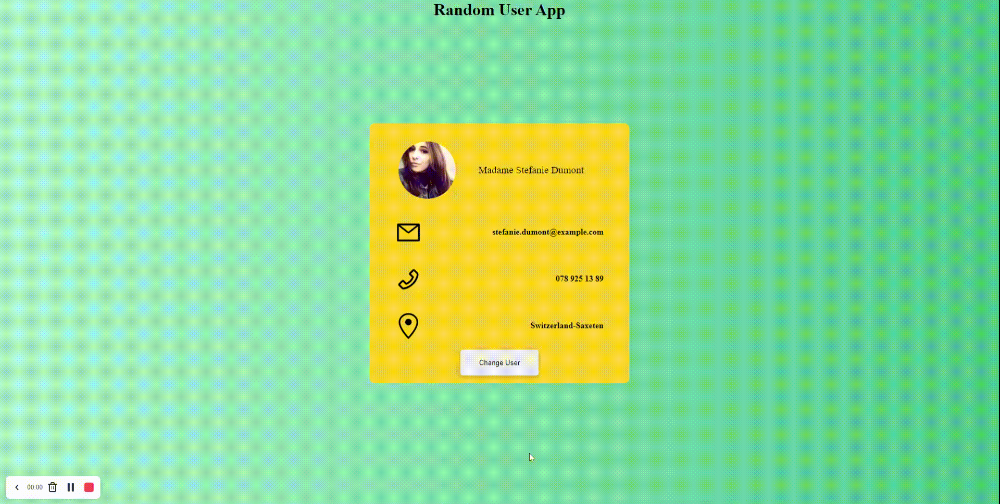

## Welcome! 👋

Thanks to visit my Github! In this project, i used axios, Bootstrap. This project is created with React and Bootstrap. Here is the link for this project (https://omer-cicek.github.io/single_random_user_app/)

**To do this project, i used React, Bootstrap, axios.**

# React Tour Places

## Available Scripts

In the project directory, you can run:

### `npm install`
### `npm start`

## The challenge

Users should be able to:

- See random users and their info's 

## Got feedback for me?

Feedbacks are always improve my technical knowledge, so feel free to give me a feedback through my LinkedIn account (https://www.linkedin.com/in/omercicek97/) 🙌

**This Is What I Did!** 🚀
